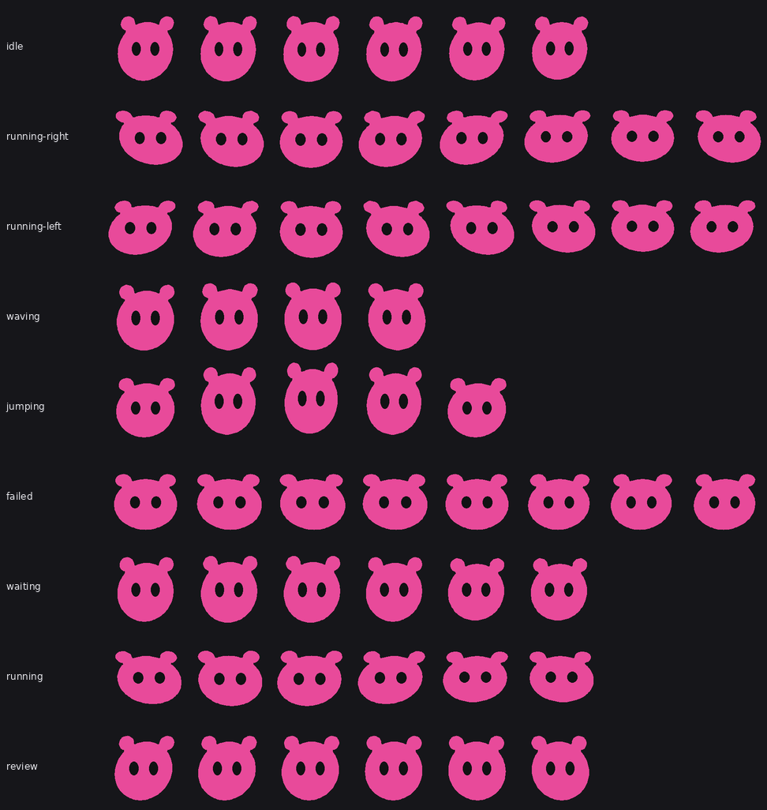

# HBlobs

A living 2D blob you can dice, sculpt, and adopt into Hermes Agent.

[](LICENSE)
[](https://hermes-agent.nousresearch.com/docs/user-guide/features/skills)
[](package.json)

Independent project. Not affiliated with Nous Research, Hermes Agent, or xAI.

<p align="center">
  
  
  
</p>

<p align="center">
  
</p>

Same mark, four locked looks. Pixels come from the SDF atlas — not image-gen.

## Quick start

Node on PATH. Then:

```bash
hermes skills install sudopimp/HBlobs/skills/blob
```

In any Hermes session:

```text
/blob
/blob color teal
/blob fatter
/blob adopt
```

`/blob adopt` copies the pack into **this process’s** `$HERMES_HOME/pets/<slug>/` and selects it. Do **not** run `hermes pets install <your-slug>` — that command is [gallery-only](https://hermes-agent.nousresearch.com/docs/user-guide/features/pets).

Need a TTY for `hermes pets show`. Desktop walk uses the roam rows in the atlas, not `--state run`.

## What you get

| You | Path |
| --- | --- |
| Hermes user | `/blob` → recipe → 1536×1872 pack → adopt |
| Sculptor | [playground/lab.html](playground/lab.html) — live springs, click-add mass, **Export pack** |
| Engineer | `defineBlob(recipe)` + `node bin/hblobs.mjs new --seed sota-demo` |

```bash
git clone https://github.com/sudopimp/HBlobs.git
cd HBlobs
node bin/hblobs.mjs new --seed sota-demo
node bin/hblobs.mjs color teal
node bin/hblobs.mjs export
# writes dist/pack/{pet.json,spritesheet.webp,recipe.json}
```

Maker locally:

```bash
python3 -m http.server 8765 --directory playground
# open http://127.0.0.1:8765/lab.html
```

`file://` will not load the ES module lab.

## Atlas

8×9 Codex sheet, 192×208 cells. Unused columns are clear. `running-left` is a mirror of `running-right`.

<p align="center">
  
</p>

More loops: [wave](demos/wave.gif) · [jump](demos/jump.gif) · [gallery](demos/index.html)

## Why this exists

Fetched 2026-08-19 (sources in [`evidence/research/share-readme-2026-08-19.md`](evidence/research/share-readme-2026-08-19.md)):

| Product | They win | We occupy |
| --- | --- | --- |
| [Glisten](https://renato.design/glisten/) v00000-248 (2026-08-10) | 3D SDF CSG, click-to-drop | 2D capsule / rbox / subtract + springs |
| [KuroBlob-AI](https://github.com/eykicuihb/KuroBlob-AI) (created 2026-08-12) | NL → live Canvas | `/blob` compiles to a recipe table. **Never `eval`** |
| [DiceBear blobs 10.x](https://www.dicebear.com/styles/blobs/) | Instant seed URL | `--seed` + named looks, then a living pack |
| [hatch-pet](https://github.com/openai/skills/blob/main/skills/.curated/hatch-pet/SKILL.md) | Any character from image-gen | Deterministic atlas pipeline, no token raster |

Empty cell we actually ship: **2D SDF recipe + 2nd-order springs + chrome face + slash mutate + Hermes drop-in pack.** We do not beat Glisten at CAD. We do not beat hatch-pet at “any otter from a prompt.”

## Locked `/blob` verbs

`new` · `make` · `color` · `fatter` · `thinner` · `taller` · `rounder` · `add` · `undo` · `name` · `export` · `adopt` · `show` · `open`

Unknown looks (`goth-cyber`, …) fail closed. The skill copies only referenced `scripts/` ([Hermes skills](https://hermes-agent.nousresearch.com/docs/user-guide/features/skills)).

## Before you paste a fail

- `/blob` is a **skill slash**, not a native `/pet`. A confused model can invent a PNG — the skill says not to; all writes go through `hblobs`.
- Not bundled. Profiles created with `--no-skills` still need the install.
- Do not write `~/.codex/pets`. Hermes will not see it.
- No `createdBy: "generator"` stamp (that is `/hatch`).
- First hub install shows the third-party warning. We are not in official `TRUSTED_REPOS`.

## License

[MIT](LICENSE). Nominative “works with Hermes Agent” only. No Hermes / Nous / xAI logos.
